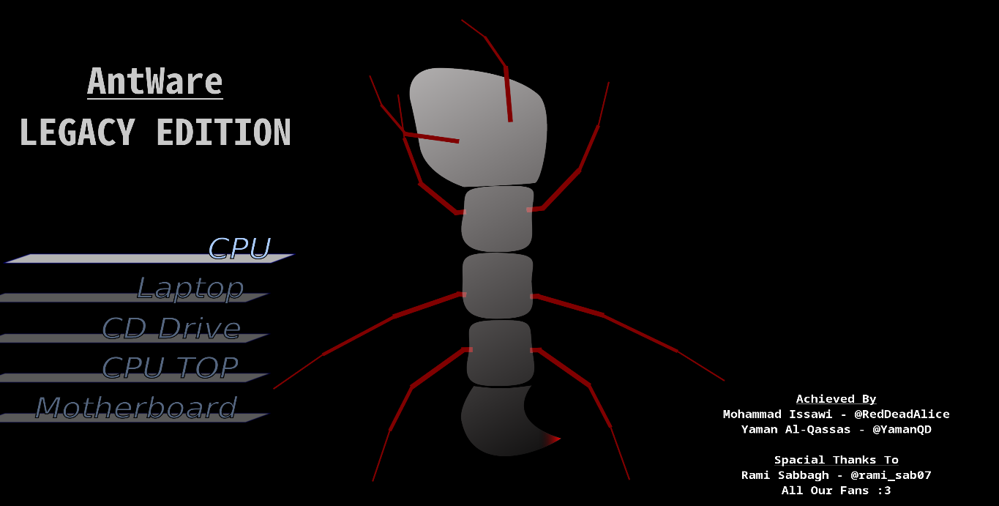
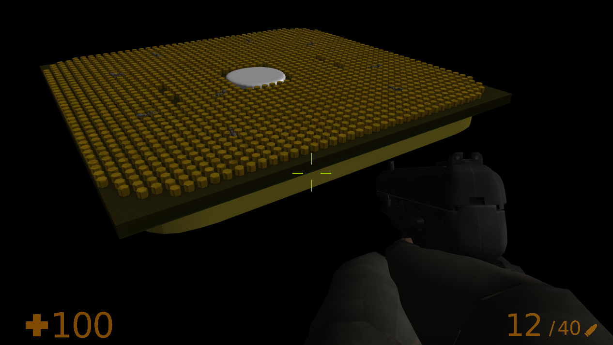
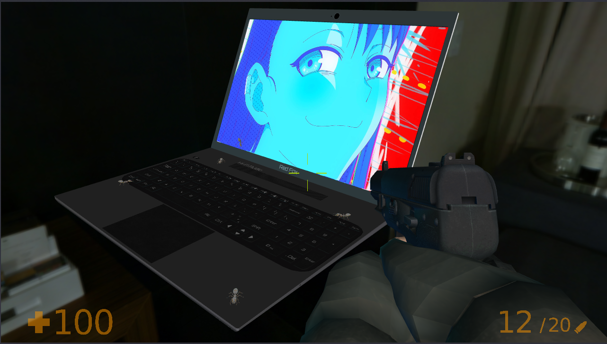
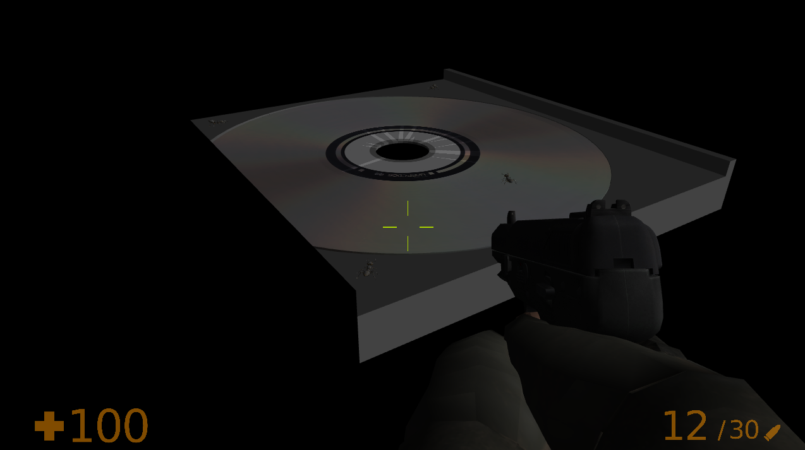
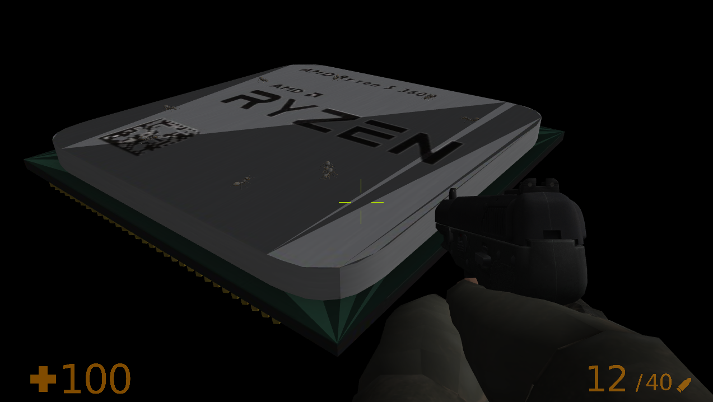
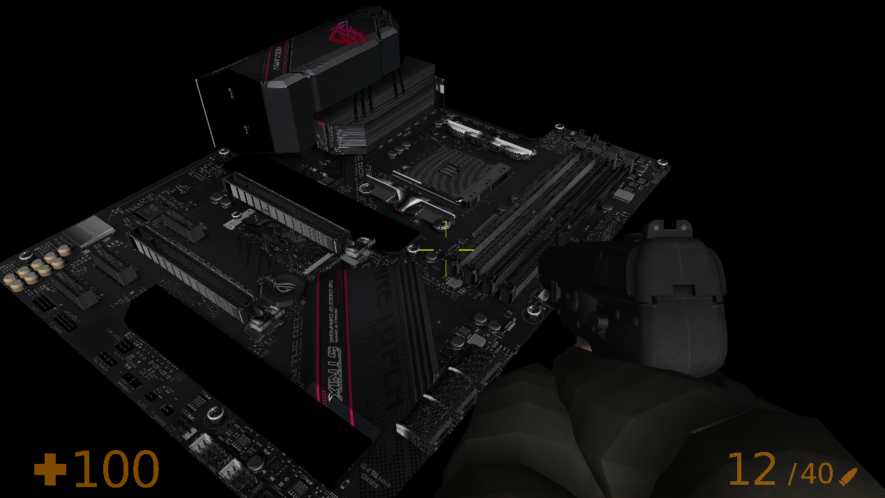

# AntWare: LEGACY EDITION 🐜⚔

A small game made by a couple of students as a university project.
Built from scratch using C++ and Legacy OpenGL, hence the name.

## Story

While you're casually working on your PC, you're surprised by a bunch of ants in your PC's inner parts, working hard to destroy them.
So you grab your gun and get in there to SEARCH AND DESTROY every last one of them.
But be careful... some of these ants were struck by cosmic lightning and now they're HUNTING YOU DOWN.

## Gameplay

Player wins when all ants are dead.
Player loses if his HP reaches zero, he runs out of ammo, or he falls of the map.

### [Game Demo](https://youtu.be/YjLi0lY-T60)

## Screenshots

### Main Menu

### Levels

## Assets

### 3D Models
- [Player](https://skfb.ly/opxOo)
- [Ant](https://skfb.ly/onZFU)
- [CPU](https://skfb.ly/on9Ao)
- [Laptop](https://skfb.ly/onRBU)
- [CD Drive](https://skfb.ly/6FSsQ)
- [CD](https://skfb.ly/6SAOI)
- [Motherboard](https://skfb.ly/6VuN9)
- [Bullet](https://skfb.ly/6WOKZ)

### Music
- [Playlist](https://youtube.com/playlist?list=PLq2aS32V3IdYErNVHD19SYDd0Jw0xeJ1h)

### Artwork
- Main Menu - by [RedDeadAlice](https://github.com/RedDeadAlice)
- [Muzzle flash](https://pin.it/3HtyRTw)